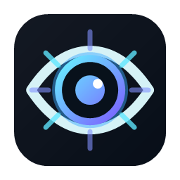

# MicToggle



MicToggle is a small Windows push-to-talk wrapper for ChatGPT voice mode. It
keeps ChatGPT in a dedicated WebView2 window, enables its microphone only while
you hold `Left Ctrl + Alt`, and leaves the rest of the system microphone alone.

MicToggle is independent and unofficial. It is not affiliated with, endorsed
by, or sponsored by OpenAI. ChatGPT is a trademark of OpenAI. Use of ChatGPT is
subject to the [OpenAI Terms of Use](https://openai.com/policies/terms-of-use/).

## Features

- Hold `Left Ctrl + Alt` to talk; release either key to mute ChatGPT again.
- Starts ChatGPT voice mode automatically when the page exposes the voice button.
- Refreshes ChatGPT voice mode after 10 minutes without push-to-talk activity.
- Uses a dedicated WebView2 profile, so it does not control or depend on Chrome.
- Controls only MicToggle's WebView audio volume, not the Windows master volume.
- Runs in the notification area; double-click the tray icon to show the window.
- Closing the window hides it. Use the tray menu's `Exit` command to quit.
- Does not suppress the hotkey or block normal keyboard input.

## Requirements

- Windows 10 or Windows 11, x64. Other Windows architectures are not yet tested.
- [.NET 8 Desktop Runtime](https://dotnet.microsoft.com/en-us/download/dotnet/8.0).
- [Microsoft Edge WebView2 Evergreen Runtime](https://developer.microsoft.com/microsoft-edge/webview2/).
- A ChatGPT account with access to voice mode.

## Install

1. Download `MicToggle-win-x64.zip` and its `.sha256` file from the
   [latest GitHub release](https://github.com/songmw90/mictoggle/releases/latest).
2. Extract the archive to a normal local folder.
3. Run `MicToggle.exe` and sign in to ChatGPT in the MicToggle window.
4. Hold `Left Ctrl + Alt` while speaking.

Project release archives are currently unsigned, so Windows SmartScreen may
show a warning. Verify that the archive came from the expected repository and
check it against the published `.sha256` file before running it.

MicToggle does not install itself or create a startup entry. To start it with
Windows, place a shortcut to `MicToggle.exe` in `shell:startup`.

## Privacy and security

MicToggle has no analytics, custom account system, or project-operated backend.
ChatGPT traffic goes directly through the embedded WebView2 browser. The app
stores its separate browser profile under `%LOCALAPPDATA%\MicToggle\WebView2`
and its output-volume setting under `%LOCALAPPDATA%\MicToggle`.

The app installs a Windows low-level keyboard hook to recognize the fixed
push-to-talk chord. It keeps only current key state in memory, forwards every
event to Windows, and does not log or transmit keystrokes. See [PRIVACY.md](PRIVACY.md)
for the complete behavior disclosure.

## Project status

MicToggle embraces the beauty of incompleteness: it ships the original fixed
hotkey, original icon, and a deliberately small settings surface. ChatGPT can
change its page structure at any time, which may break voice-mode auto-start.
Focused pull requests for configurable shortcuts, accessibility, icons, and
compatibility are welcome.

## Build and test

```powershell
dotnet restore MicToggle.sln --locked-mode
dotnet test MicToggle.sln -c Release --no-restore
```

Create the framework-dependent Windows release archive:

```powershell
.\scripts\publish.ps1
```

The script writes `artifacts\MicToggle-win-x64.zip` and its matching
`.sha256` file. The archive contains the project license, privacy notice, and
exact third-party license files.

## Contributing

Read [CONTRIBUTING.md](CONTRIBUTING.md). Small, focused changes are preferred.
Do not submit OpenAI logos, copied product artwork, credentials, cookies, or
other assets that you do not have the right to license.

## License

MicToggle source code and original icon assets are licensed under the
[MIT License](LICENSE). Third-party components remain under their respective
licenses listed in [THIRD-PARTY-NOTICES.md](THIRD-PARTY-NOTICES.md).
